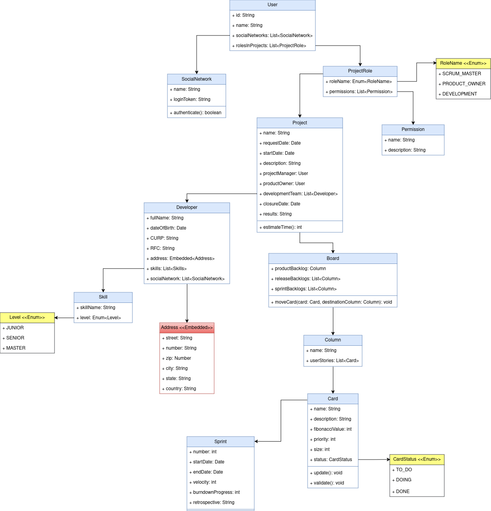
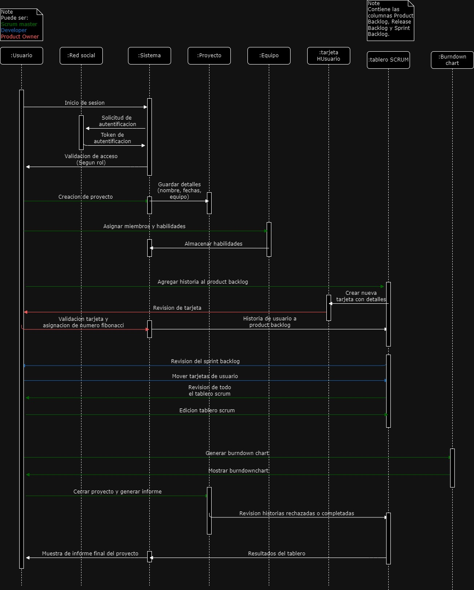

# Proyecto reto I: Desarrollar un manejador de proyectos

## En esta publicación encontraras el documento que contiene el marco del proyecto a desarrollar durante el curso y tendrá valor en cada parcial según los criterios de evaluación. Toma en cuenta las siguientes cuestiones:

1) Selecciona tu equipo (el número de integrantes dependerá de lo acordado en clase).

2) Comprendan el documento adjunto y discutan entre los integrantes del equipo.

3) Sí existen dudas pregunten inmediatamente en la publicación o con el profesor en clase.

4) Al final de cada periodo existirá una tarea donde se deberá entregar los puntos a evaluar (uno por cada periodo).

5) Recuerda que se evalúa calidad del código, completitud del proyecto, funcionalidades, entrega a tiempo, participación de todo el equipo y correcta documentación y pruebas.

### Para el primer parcial se evaluara lo siguiente:

* 1) Estructura del proyecto (10 puntos).

* 2) Diagrama de clases que cubra todos los requerimientos solicitados (20 puntos).

Este diagrama de clases muestra la estructura de un sistema para gestionar proyectos usando la metodología SCRUM, donde se modelan entidades como User, Project, Sprint, y Board, con relaciones entre ellas. Los usuarios tienen diferentes roles, como SCRUM Master o Product Owner, y pueden interactuar con elementos como las tarjetas y backlogs en el tablero. Además, se gestionan las habilidades de los desarrolladores y el progreso de los sprints mediante gráficos de BurnDownChart y retrospectivas.

* 3) Todas las rutas necesarias para que el proyecto funcione con base al modelo REST (20 puntos).

* 4) Wireframes del flujo del proyecto (20 puntos).
Un wireframe es un esquema visual básico de una página web o aplicación, que muestra la disposición y estructura de los elementos sin detallar el diseño final.
https://www.canva.com/design/DAGRn-gkV5o/Q4O92K0h6R-BvSCc4UhFwg/edit?utm_content=DAGRn-gkV5o&utm_campaign=designshare&utm_medium=link2&utm_source=sharebutton

* 5) Diagrama de interacción que explique el flujo según los requerimientos. (20 puntos).

Este diagrama de interacción muestra el flujo de trabajo en un sistema basado en SCRUM. Un usuario inicia sesión y autentica su acceso mediante una red social. Luego, se crea un proyecto donde se asignan miembros y habilidades, se agregan historias al product backlog y se crean tarjetas para las tareas. El SCRUM board se actualiza a medida que las tarjetas avanzan, y se genera un gráfico burndown que refleja el progreso. Al final, se cierra el proyecto y se genera un informe final con los resultados del tablero.

* 6) Imagen de Docker funcional en docker hub (10 puntos).